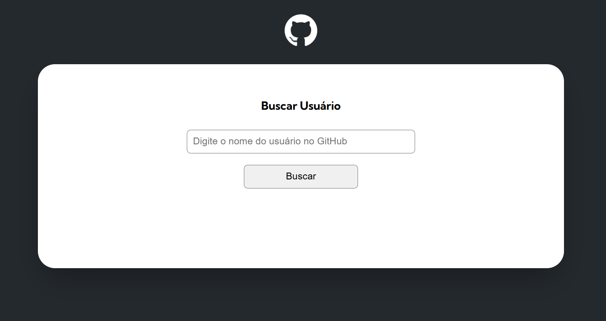

# projeto-fetch-github-api
Projeto do curso DevQuest usando fetch no JS para buscar um usuário na API do GitHub

# GitHub Finder 🔍
> Aplicação web para buscar e exibir perfis de usuários do GitHub usando a API oficial.

## Funcionalidades
- Busca de usuários
- Visualização de perfil
- Lista de repositórios
- Número de seguidores do usuário
- Número de pessoas que o usuário está seguindo
- Eventos recentes
- Quantidade de forks do repositório
- Quantidade de estrelas do repositório
- Quantidade de watchers do repositório
- Mostrar a linguagem de programação do repositório

## Tecnologias
- HTML5, CSS3, JavaScript 
- GitHub REST API

## Como usar
1. Clone o repositório
2. Abra index.html no navegador

## Layout

  
  

## API endpoints
- /users/{username}
- /users/{username}/repos
- /users/{username}/events

